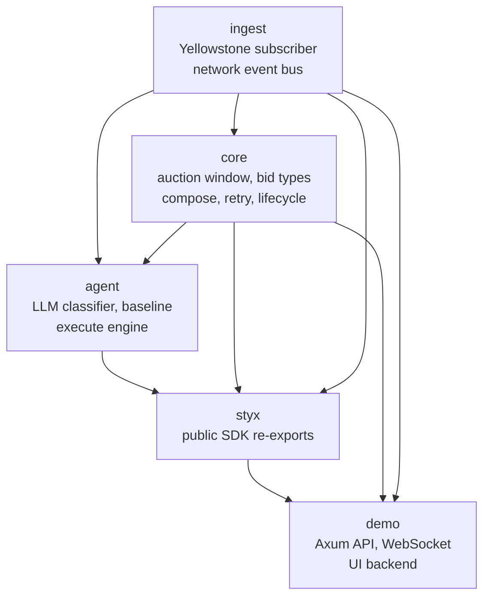
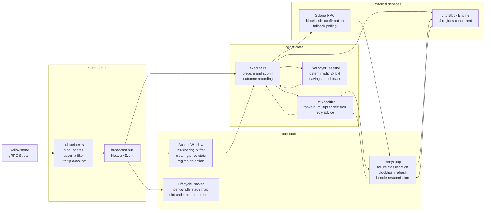
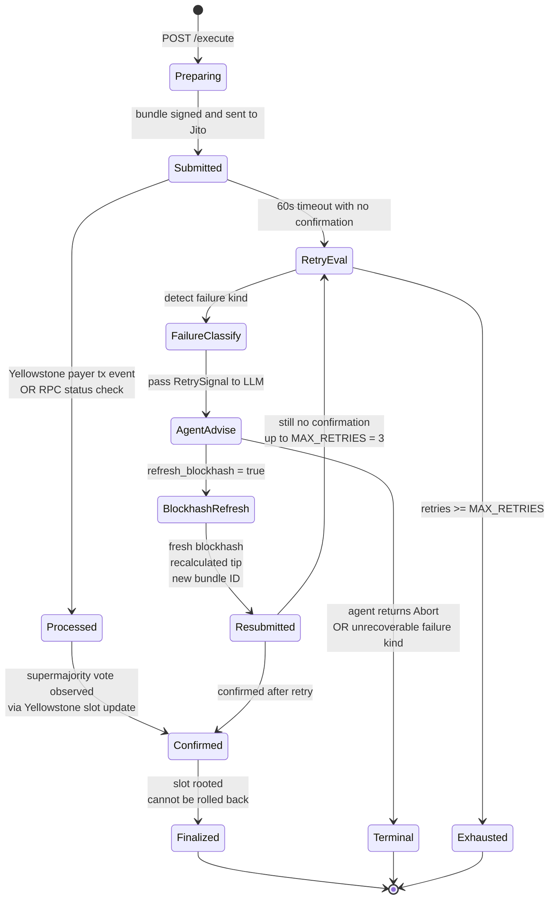
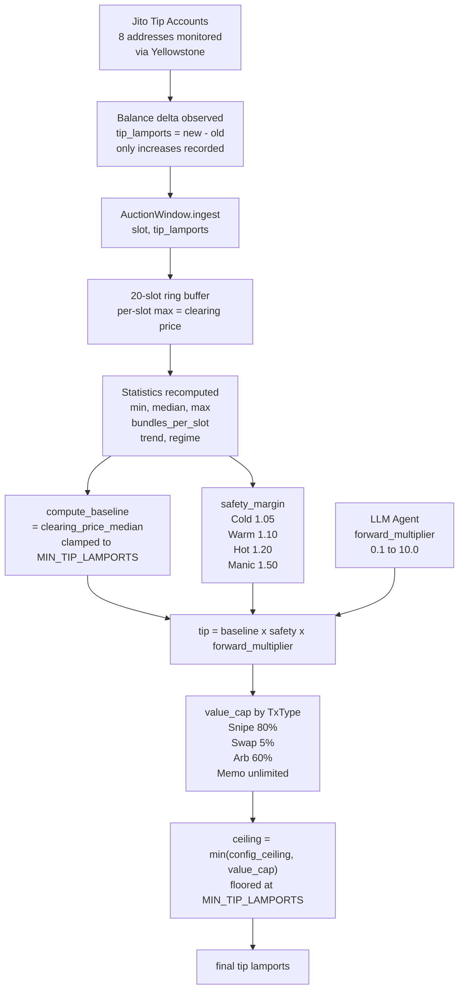
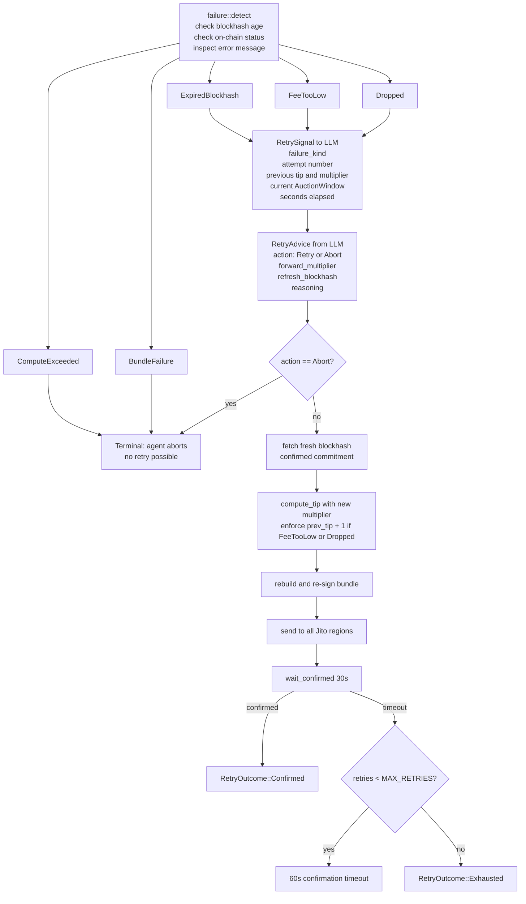
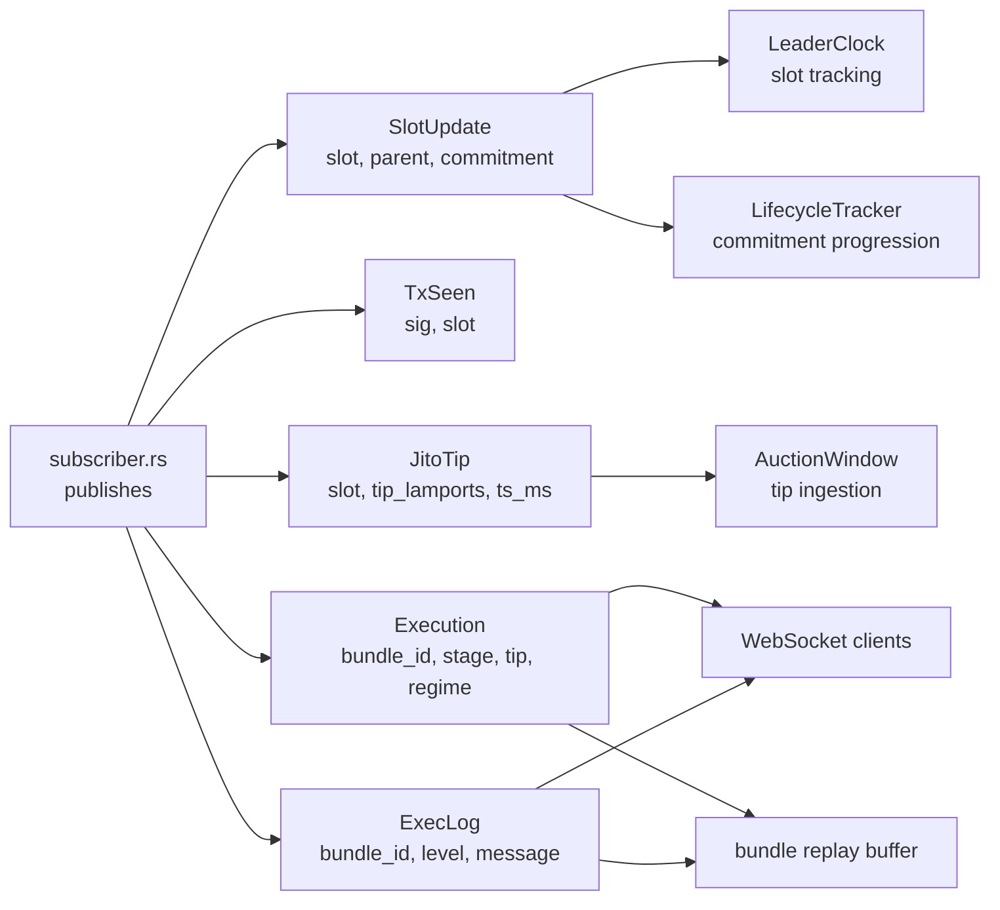
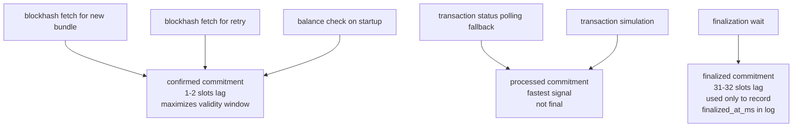
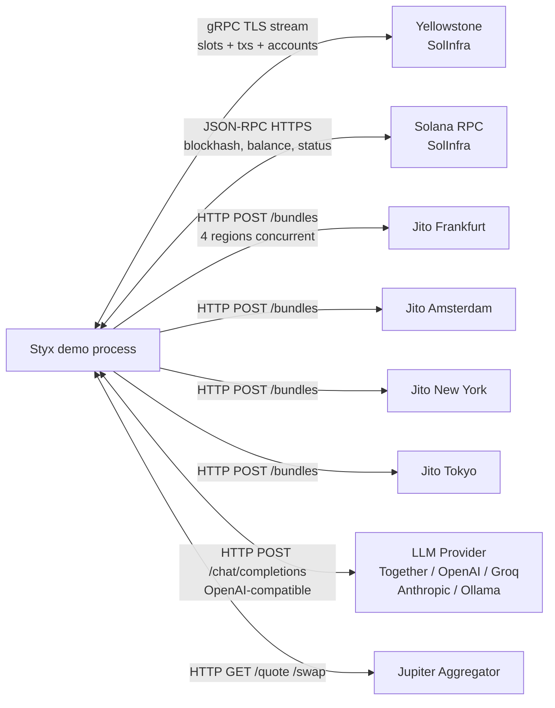

# Styx Architecture

## System Overview

Styx is organized as a Rust workspace of five crates with clear separation between network ingestion, core transaction logic, AI decision-making, and the user-facing API. Data flows in one direction: the network feeds the ingest layer, the ingest layer feeds the core layer via an event bus, and the agent layer reads from both to make decisions and drive execution.

## Crate Dependency Graph

## Data Flow

## Bundle Lifecycle State Machine

## Tip Pricing Pipeline

## Retry Decision Flow

## Network Event Bus

## Commitment Level Usage

## Infrastructure Connections

