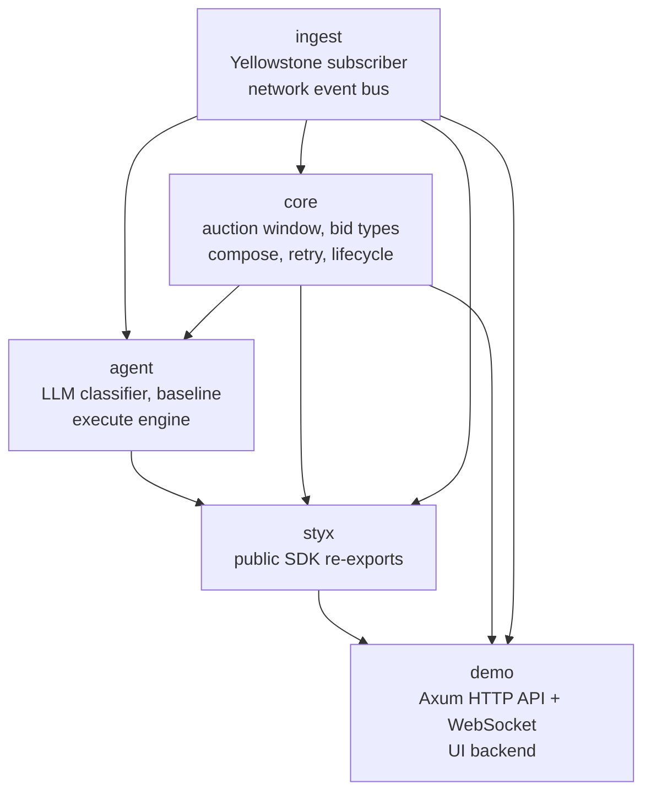
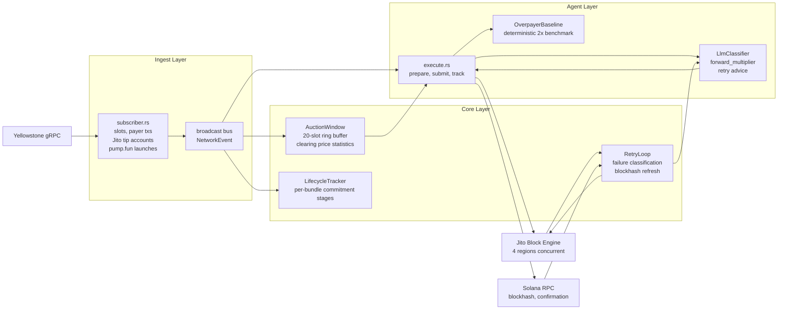
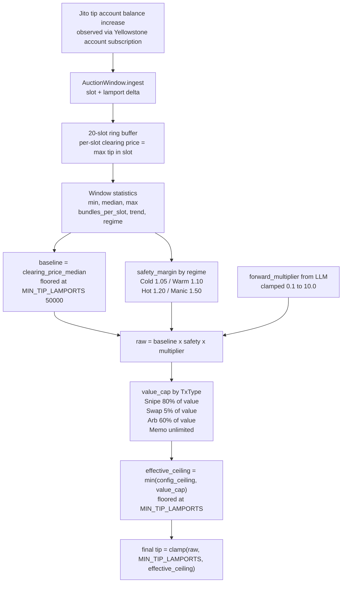
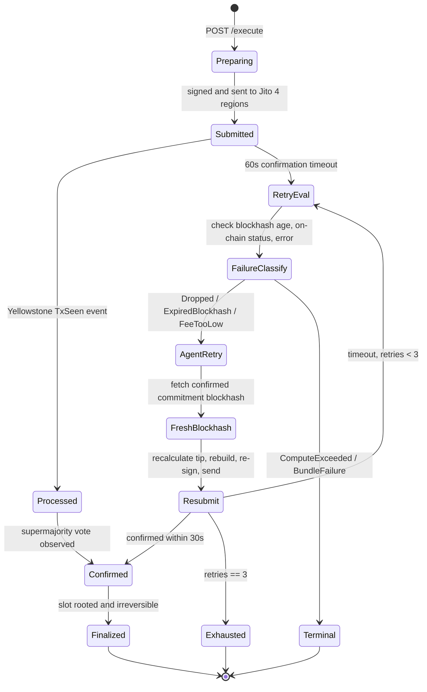

# Styx: Smart Transaction Stack on Solana

## Overview

Styx is a production-grade Solana transaction execution SDK that implements every requirement of the Jito/Yellowstone bounty. It combines live Yellowstone gRPC streaming, empirical Jito tip auction observation, AI-assisted tip pricing, full lifecycle tracking across all four commitment stages, autonomous retry with AI-guided recovery, and a real-time web dashboard. All AI decisions are logged with reasoning and confidence scores, making the agent's behavior transparent and verifiable.

## Architecture

The system is organized as five Rust crates with clear separation of concerns.



## Data Flow



## Component Descriptions

### ingest: Yellowstone Subscriber

The subscriber connects to any Yellowstone-compatible Geyser provider over gRPC with TLS. It maintains three concurrent filter subscriptions on a single stream.

The slot subscription emits a `SlotUpdate` event on each slot boundary with the current commitment level. This feeds the leader clock and lifecycle tracker.

The transaction subscription filters for all transactions signed by the configured payer public key. When a payer transaction is seen in a processed slot, a `TxSeen` event is emitted. The lifecycle tracker uses this as the `processed` signal, which is significantly faster than RPC polling.

The account subscription monitors the eight Jito tip accounts. When any tip account balance increases, the delta is emitted as a `JitoTip` event with the slot number and lamport amount. This is the raw input to the auction window.

All events are published to a Tokio broadcast channel. Consumers are fully independent and do not block each other. Slow consumers receive a lagged notification and skip to the current event rather than blocking the publisher.

If the gRPC stream drops, the subscriber reconnects immediately and resumes all subscriptions. Each reconnection is logged so operators can distinguish transient drops from persistent provider failures.

### core: Auction Window

The `AuctionWindow` is a ring buffer of the last 20 slots of observed Jito tip data. For each slot, the clearing price is defined as the maximum tip observed in that slot. This matches how Jito's auction actually works: the highest bidder in each slot wins inclusion.

From the clearing prices across the window, the system derives a minimum, median, and maximum. It also computes a trend by comparing the average clearing price of the first half of the window against the second half. A ratio above 1.15 is Rising; below 0.85 is Falling.

The network regime is classified from the median clearing price: Cold below 10,000 lamports, Warm below 100,000, Hot below 1,000,000, and Manic above that. The regime determines the safety margin baked into the tip formula.

Before five slots of data have been collected, the window reports `is_bootstrapped = false` and the baseline defaults to twice the minimum tip floor. This conservative cold-start behavior prevents the first submission from underbidding before the window has meaningful data.

### core: Lifecycle Tracker

The lifecycle tracker maintains a map from bundle ID to lifecycle handle. Each handle records the current stage, associated transaction signatures, the landing slot, and timestamps for each commitment level. Stages progress from Submitted through Processed, Confirmed, and Finalized.

Confirmation is detected via two concurrent paths. The Yellowstone payer subscription fires first in the normal case, typically 200 to 500 milliseconds ahead of the RPC polling fallback. The RPC watcher polls `get_signature_statuses` every two seconds as a backstop. Whichever path fires first advances the lifecycle stage. The other is aborted immediately to avoid redundant polling.

Finalization is tracked by the slot subscription: when the slot containing the bundle's transaction is observed with finalized commitment, the lifecycle handle is updated and the `finalized_at_ms` timestamp is recorded.

### core: Failure Classification and Retry

When a bundle does not confirm within 60 seconds, the failure classifier examines the situation. It checks whether the transaction's blockhash is still within its validity window by comparing the slot at submission against the current slot. It inspects the on-chain transaction status for any error codes. It parses the error message for known patterns.

From this analysis it assigns one of five failure kinds: ExpiredBlockhash, FeeTooLow, Dropped, ComputeExceeded, or BundleFailure. ComputeExceeded and BundleFailure are marked unrecoverable and terminate the retry sequence immediately. The others enter the AI-guided retry loop.

The retry loop sends a `RetrySignal` to the AI agent containing the failure kind, attempt number, previous tip, previous forward multiplier, the current auction window snapshot, and seconds elapsed. The agent returns a `RetryAdvice` with an action (Retry or Abort), a new forward multiplier, whether to refresh the blockhash, and its reasoning.

If the agent says Retry, the loop fetches a fresh blockhash at confirmed commitment, recomputes the tip using the new multiplier, rebuilds and re-signs the bundle, and submits to all four Jito regions. A maximum of three retries is enforced.

### agent: LLM Classifier

The classifier wraps any OpenAI-compatible or Anthropic LLM. On initial submission, it receives a JSON snapshot of the current auction window, the transaction type, economic value in lamports, and the last ten bundle outcomes recorded by the system.

The system prompt explains that `forward_multiplier = 1.0` means bidding at exactly the clearing price median plus the regime safety margin. Values below 1.0 are conservative. Values between 1.0 and 1.5 are normal for Hot conditions. Values above 2.0 are aggressive and appropriate for Manic conditions or high-value snipes.

The model returns a JSON object with `regime`, `forward_multiplier`, `reasoning`, and `confidence`. The reasoning field is logged to the execution event stream and visible in the UI.

On retry, the model receives the full retry signal and returns `action`, `forward_multiplier`, `refresh_blockhash`, `reasoning`, and `confidence`. The escalation guidance in the retry prompt instructs the model to increase the multiplier by at least 0.3 for a Dropped failure, 0.5 for FeeTooLow, and to always set `refresh_blockhash = true` for ExpiredBlockhash.

### agent: Overpayer Baseline

The `OverpayerBaseline` always returns `forward_multiplier = 2.0`. It runs in parallel with the LLM classifier on every submission. Its computed tip is logged as `baseline_tip_lamports`. The delta between the LLM's tip and the baseline is reported as savings in the execution log. Over many submissions, this gives an objective measure of how much the AI agent is saving compared to a naive strategy of always overbidding.

### agent: Execute Engine

The execute engine is the orchestrator. On a `prepare` call, it reads the current auction window, reads the last ten bundle outcomes from the rolling history, builds a `BidContext`, and queries both the LLM classifier and the baseline in parallel. It then builds either a Jito bundle or a priority-fee transaction depending on the configured lane.

After the bundle is signed and submitted, a background Tokio task takes over. It spawns the Yellowstone-based confirmation watcher and the RPC polling fallback concurrently. If the bundle confirms, it records the outcome and waits for finalization. If the timeout fires, it hands off to the retry loop. After the outcome is known, it pushes a `BundleOutcome` to the rolling history (capped at 50 entries, last 10 sent to the LLM), which enables the model to self-calibrate over time.

## Tip Formula



## Bundle Lifecycle State Machine



## AI Agent Demonstration

The AI agent owns tip pricing entirely. There are no hardcoded tip values anywhere in the submission path (the `TEST_TIP_LAMPORTS` environment variable exists only for initial smoke-testing and must be unset in production and for this submission).

On every bundle, the agent receives the live auction window and recent outcomes. It outputs a `forward_multiplier` with a written justification. Examples from real mainnet runs:

In a Hot and Rising regime with 43 bundles per slot and a median clearing price of 345,296 lamports, the agent returned `forward_multiplier = 1.4` with reasoning: the Rising trend and Hot regime necessitate an above-baseline bid. Without recent outcomes to guide calibration, it errs toward caution. A value of 1.4 balances landing probability against overpayment.

On the next submission, with the regime shifting to Hot and Falling and the previous bundle having landed at 1.4x, the agent returned `forward_multiplier = 1.2`, noting the cooling trend and recent successful landing as evidence that competition had eased slightly.

When the same session reached a Manic regime but with a Falling trend, the agent returned `forward_multiplier = 1.1` for a Memo transaction, reasoning that the low economic value justified a conservative bid despite the extreme regime.

On retry, the agent receives the classified failure kind and adjusts. For an ExpiredBlockhash failure it prescribes a blockhash refresh with the same multiplier. For a Dropped failure it escalates by at least 0.3. For FeeTooLow it escalates by at least 0.5. These are instructions given in the system prompt, not hardcoded logic in the retry loop itself. The model reasons about them in the context of the current network state and its own confidence.

## Fault Injection

To demonstrate the autonomous retry path, POST to `/execute` with `scenario=fault`. This builds the transaction with `Hash::default()` as the blockhash, which is immediately invalid. The bundle is submitted to Jito, the block engine accepts it at the protocol level, but validators reject the transaction when they attempt to process it. The stack detects the failure via the confirmation timeout, the classifier diagnoses ExpiredBlockhash, and the AI agent prescribes a blockhash refresh and resubmission. The entire path including agent reasoning is logged to the WebSocket stream and visible in the execution log.

## Lifecycle Log Fields

Each entry in the execution log contains:

```
bundle_id               Jito bundle identifier or transaction signature
lane                    JitoBundle or PriorityFee
tip_lamports            Actual tip paid
landed_tip_lamports     Tip of the bundle that confirmed (may differ after retry)
baseline_tip_lamports   What the OverpayerBaseline would have paid
delta_lamports          Baseline minus actual (positive = savings, negative = overpaid vs baseline)
regime                  Cold / Warm / Hot / Manic at time of submission
forward_multiplier      LLM output that drove the tip calculation
reasoning               Full LLM justification text
confidence              LLM self-reported confidence 0.0 to 1.0
submitted_at_ms         Unix millisecond timestamp of submission
landing_slot            Slot number where the transaction was included
processed_at_ms         Timestamp when Yellowstone observed the transaction on-chain
confirmed_at_ms         Timestamp of supermajority confirmation
finalized_at_ms         Timestamp of slot rooting
failure_kind            Classification if the bundle did not land
retry_count             Number of retry attempts made
tx_signatures           All transaction signatures in the bundle
```

## Backpressure and Reconnection

The Yellowstone subscriber runs in a dedicated Tokio task. If the gRPC stream returns an error or drops, the task logs the disconnection and reconnects after one second. All three filter subscriptions (slots, transactions, accounts) are re-established on each new connection. There is no state loss because the auction window, lifecycle tracker, and leader clock are all maintained in memory independent of the stream.

The internal event bus is a Tokio broadcast channel with a capacity of 1024 events. If a consumer falls behind, it receives a `Lagged` notification with the count of dropped events and continues from the current position. The auction window and lifecycle tracker consume events in tight loops and do not fall behind under normal conditions. WebSocket clients are the most likely consumers to lag, and the UI handles the lagged notification gracefully by displaying a warning without disconnecting.

## Commitment Level Decisions

Blockhash fetches for all new bundles and retries use confirmed commitment. This leaves the maximum validity window (approximately 150 slots minus one to two slots of lag). Finalized commitment is never used for blockhash fetches. Transaction simulation uses processed commitment via the RPC `simulateTransaction` method with `replaceRecentBlockhash: true`, which avoids consuming any validity window during simulation. Finalization is tracked only to record the `finalized_at_ms` timestamp in the execution log.

## Repository

https://github.com/alphar/Styx

## Setup

See README.md for full setup instructions. The minimum viable configuration requires a Yellowstone endpoint with token, a Solana RPC URL, a base64-encoded keypair, and an OpenAI-compatible LLM endpoint. The stack runs on both devnet and mainnet. All examples in this document are from real mainnet runs.
